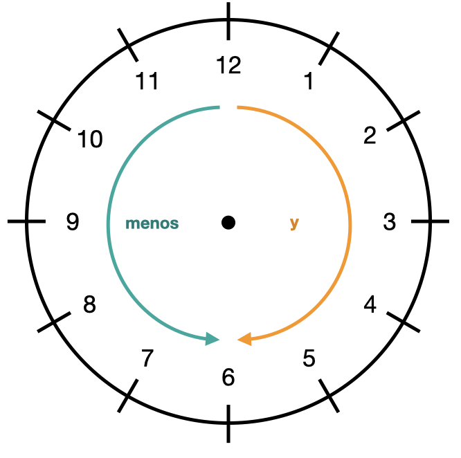

# Alphabet

| Buchstabe | Aussprache     |
| --------- | -------------- |
| A         | a              |
| B         | be             |
| C         | ce             |
| D         | de             |
| E         | e              |
| F         | efe            |
| G         | ge             |
| H         | hache          |
| I         | i              |
| J         | jota           |
| K         | ka             |
| L         | ele            |
| M         | eme            |
| N         | ene            |
| Ñ         | eñe            |
| O         | o              |
| P         | pe             |
| QU        | cu             |
| R         | erre           |
| S         | ese            |
| T         | te             |
| U         | u              |
| V         | uve            |
| W         | uve doble      |
| X         | equis          |
| Y         | ye, i griega   |
| Z         | zeta           |
|           |                |
| ch        | ce hache       |
| ll        | doble ele      |
| rr        | doble erre     |
| ü         | u con diéresis |
| M         | m mayúscula    |
| m         | m minúscula    |

# Berufe

- ser + Beruf (= ich bin ...)
- trabajar como/de + Beruf (= ich arbeite als ...)
- Endung *-o* -> Ersetzten durch *-a* für feminine Form
- Endung *-or* -> *+a* für feminine Form
- Endung *-nte, -ista* -> unverändert

| Deutsch          | Spanisch       |
| ---------------- | -------------- |
| Angestellter     | empleado/-a    |
| Architekt        | architecto/-a  |
| Arzt             | médico/-a      |
| Informatiker     | informático/-a |
| Kellner          | camarero/-a    |
| Krankenschwester | enfermero/-a   |
| Journalist       | periodista     |
| Polizist         | policía        |
| Professor        | profesor/a     |

# Beschreibungen

## Personen

### Haare

- er hat ... Haare = él tiene el pelo ...

| Deutsch        | Spanisch        |
| -------------- | --------------- |
| blonde Hare    | el pelo rubio   |
| braune Haare   | el pelo castaño |
| dunkle Haare   | el pelo oscuro  |
| schwarze Haare | el pelo negro   |
| lockige Haare  | el pelo rizado  |
| lange Haare    | el pelo largo   |

### Augen

hat ... Augen = tiene los ojos ...

| Deutsch  | Spanisch |
| -------- | -------- |
| blaue    | azules   |
| braune   | marrones |
| graue    | grises   |
| grüne    | verdes   |
| schwarze | negros   |

### Sonstiges

| Deutsch           | Spanisch             |
| ----------------- | -------------------- |
| trägt Bart        | lleva barba          |
| trägt Schnurrbart | lleva bigote         |
| groß              | alto/-a              |
| klein             | bajo/-a; bajito/-ita |
| dünn              | delgado/-a           |
|                   |                      |
|                   |                      |

### Charakter

| Deutsch     | Spanisch              |
| ----------- | --------------------- |
| charmant    | encantador/-a         |
| ernst       | serio/-a              |
| ruhig       | tranquilo/-a          |
| sympatisch  | sympático/-a          |
| schön       | hermoso/-a; bonito/-a |
| intelligent | inteligente           |

## Orte

| Deutsch      | Spanisch      |
| ------------ | ------------- |
| berühmt      | famoso/-a     |
| faszinierend | fascinante    |
| groß         | grande        |
| hoch         | alto/-a       |
| isoliert     | aislado/-a    |
| lang         | largo/-a      |
| mysteriös    | misterioso/-a |
| schön        | hermoso/-a    |
| spektakulär  | espectacular  |
| wild         | salvaje       |

# Bewertungen

|      |               |
| ---- | ------------- |
| +++  | muy bien      |
| ++   | bastante bien |
| +    | bien          |
| +/-  | regular       |
| -    | mal           |
| --   | bastante mal  |
| ---  | muy mal       |

# Familie

## Familienstand

estar + Familienstand

**! Ausnahme:** ser + viudo/-a (verwitwet)

| Deutsch     | Spanisch      |
| ----------- | ------------- |
| ledig       | soltero/-a    |
| geschieden  | divorciado/-a |
| getrennt    | separado/-a   |
| verheiratet | casado/-a     |
| verwitwet   | viudo/-a      |
| verlobt     | prometido/-a  |

## Stammbaum

| Deutsch                             | Spanisch                               |
| ----------------------------------- | -------------------------------------- |
| Mutter / Vater / Eltern             | la madre / el padre / los padres       |
| Schwester / Bruder /Geschwister     | la hermana / el hermano / los hermanos |
| Tochter / Sohn / Kinder             | la hija / el hijo / los hijos          |
| Großmutter / Großvater / Großeltern | la abuela / el abuelo / los abuelos    |
| Tante / Onkel                       | la tía / el tío                        |
| Cousine / Cousin                    | la prima / el primo                    |
| Nichte / Neffe                      | la sobrina / el sobrino                |

# Fragen

- Cómo = Wie
- Cuál = Was/Welcher
- Dónde = Wo
- Cuántos/-as = Wie viele
- Por qué = Warum
- Qué = Was
- Quién = Wer 

### Fragepronomen qué, cuál

- Dinge in einer Gruppe identifizieren:

  - Qué + Substantiv 
    z.B. ¿Qué lenguas se hablan en Bolivia?
  - Cuál/Cuáles + Verb 
    z.B. ¿Cuál es la moneda de Bolivia?

- Nach Dingen/Definitionen fragen:

  - Qué + Verb
    z.B. ¿Qué es el quechua?

  

# Grammatik Allerlei

## Adjektive

- i.d.R. nachgestellt 
  z.B. Mi amiga Lisa es una persona *inteligente*
- Vorangestellt nur falls man Eigenschaft besonders hervorheben will
  z.B. La *triste* chicha es su hermana. = Hervorheben der *Traurigkeit*
         La chicha *triste* es su hermana. = Unterscheiden zwischen mehreren Personen.
- Adjektive für Farbe, Form, Nationalität, Zustand **immer** nachgestellt.

##### Änderung maskuline Form

- Substantiv + Adjektiv -> bueno/malo/grande/primero/tercero
  z.B. Tiene un ambiente **bueno**
- Adjektiv + Substantiv -> männlich **verliert -o/-e** buen/mal/gran/primer/tercer
  z.B. Tiene **buen** ambiente

## Artikel

- el/la/los/las: für Konkretes
- un/una/unos/unas: für Unbestimmtes

## Demonstativpronomen

- vor dem Subtantiv z.B. **Este** libro es muy interesante.

- getrennt vom Substantiv z.B. **Este** es un libro muy interesante.

  

|          | maskulin | feminin | neutral (für Gegenstände) |
| -------- | -------- | ------- | ------------------------- |
| Singular | este     | esta    | esto                      |
| Plural   | estos    | estas   |                           |

## Deutsches "man"

se + 3. Person

z.B. ¿Cómo **se pronuncia** la "uve"?

## Genus und Numerus

| Genus            | Endungen                                                     | Singular                                                     | Plural                                                       |
| ---------------- | ------------------------------------------------------------ | ------------------------------------------------------------ | ------------------------------------------------------------ |
| maskulin         | *-o*: meistens *maskulin* **!** Ausnahmen: la foto, la mano  *-aje, -or, -ón, -ema, -oma, -ama*: in der Regel *maskulin*  Wochentage Zahlen | el diálog**o** el vi**aje** el col**or** el cora**zón** el probl**ema** el idi**oma** el progr**ama** | los diálogo**s** los viaj**es** los color**es** los corazon**es** los problema**s** los idioma**s** los programa**s** |
| feminin          | *-a*: meistens *feminin* **!** Ausnahmen: el día, el sofá, el mapa  *-dad, -ción, -sión*: immer *feminin*  Buchstaben Uhrzeiten | la list**a** la nacionali**dad** la can**ción** la deci**sión** | las lista**s** las nacionalidad**es** las cancion**es** las decision**es** |
| maskulin/feminin | *-e, -ista*: keine Regel, beides möglich                     | el tomat**e** la noch**e** el/la estudiant**e**    | los tomate**s** las noche**s** los/las estudiante**s** |

- Endung auf -s -> Plural unverändert (el lunes -> los lunes)
- Endung auf -z -> Plural mit -ces (la nariz -> las narices)
- Substantive die auf *Konsonant* enden mit Akzent auf letzter Silbe -> Plural kein Akzent (la canci**ó**n -> las canci**o**nes)

## Präpositionen

##### A la / Al 

= an, auf, im, in, nach, um, zu, bis, pro, mit

- genaue Richtung/genaues Ziel
  z.B. Estudio español para viajar **a** Latinoamérica. (= Ich lerne Spanisch um **nach** Lateinamerika zu reisen.)
  -> genauer Plan wo es hin gehen soll

##### Para

- Zweck oder Absicht 
  z.B. Estudio español **para** trabajar en España. (=Ich lerne Spanisch, **um** in Spanien zu arbeiten.)
- Termin/Fristangaben (=für): z.B. Quiero una habitación **para** tres días. (=Ich möchte ein Zimmer **für** drei Tage.)
- Standpunkt (=für, nach Ansicht von)
  z.B. **Para** mí, esto no es grave. (=**Für** mich ist das nicht schlimm.)

##### Por

* ungefähre Ortsangaben
  z.B. Esto está **por** aquí. (= Das ist hier in der Nähe.)
* ugnefähre Zeitangaben
  z.B. Desayuno **por** la mañana. (= Ich frühstücke morgens.)
* Angabe eines Grundes
  z.B. Estudio español **por** mi trabajo. (=Ich lerne Spanisch **für** meine Arbeit.)
* Kommunikations-/Transportmittel (=per/mit)
  z.B. Te llamo **por** teléfono. (=Ich rufe dich **per** Telefon an.)
* Häufigkeit, Geschwindigkeit (=pro, in)
  z.B. Tres veces **por** la semana. / 60 kilómetros por hora (= Drei mal **pro** Woche / 60 Kilometer **pro** Stunde)

##### ¿Por qué? und porque

- ¿Por qué? = Warum = Frage
- porque = weil = Begründung

## Possesivpronomen

#### Vor dem Substantiv

- Poss.pron + Substantiv 
- Numerus + Genus angepasst an Objekt von dem man spricht
  z.B. Mi tío / Mis tíos

|              | Singular           | Plural              |                         |
| ------------ | ------------------ | ------------------- | ----------------------- |
| yo           | mi ( + Substantiv) | mis ( + Substantiv) | mein, meine             |
| tú           | tu                 | tus                 | dein, deine             |
| él/ella      | su                 | sus                 | sein, seine / ihr, ihre |
| usted        | su                 | sus                 | Ihr, Ihre               |
| nosotros/-as | nuestro/-a         | nuestros/-as        | unser, unsere           |
| vosotros/-as | vuestro/-a         | vuestros/-as        | euer, eure              |
| ellos/ellas  | su                 | sus                 | ihr, ihre               |
| ustedes      | su                 | sus                 | Ihr, Ihre               |

#### Nach dem Substantiv

- angleichen wie bei Adjektiven

|               | Singular             |                       | Plural                   |                          |
| ------------- | -------------------- | --------------------- | ------------------------ | ------------------------ |
|               | maskulin             | feminin               | maskulin                 | feminin                  |
| yo            | un amigo **mío**     | una amiga **mía**     | unos amigos **míos**     | unas amigas **mías**     |
| tú            | un amigo **tuyo**    | una amiga **tuya**    | unos amigos **tuyos**    | unas amigas **tuyas**    |
| él/ella/usted | un amigo **suyo**    | una amiga **suya**    | unos amigos **suyos**    | unas amigas **suyas**    |
| nosotros/-as  | un amigo **nuestro** | una amiga **nuestra** | unos amigos **nuestros** | unas amigas **nuestras** |
| vosotros/-as  | un amigo **vuestro** | una amiga **vuestra** | unos amigos **vuestros** | unas amigas **vuestras** |
| ellos/ellas   | un amigo **suyo**    | una amiga **suya**    | unos amigos **suyos**    | unas amigas **suyas**    |

## Und, Oder

- Und = y 
           = e falls nachfolgendes Wort mit i- oder hi- anfängt
- Oder = o
            = u falls nachfolgendes Wort mit o- oder ho- anfängt 

# Häufigkeiten

| Deutsch                        | Spanisch                                |
| ------------------------------ | --------------------------------------- |
| immer                          | siempre                                 |
| fast immer                     | casi siempre                            |
| sehr oft                       | a menudo                                |
| jeden ... (z.B. Montag)        | todos los ... (z.B. lunes)              |
| n mal pro Woche / Monat / Jahr | n veces por la semana / al mes / al año |
| manchmal                       | a veces                                 |
| alle n Tage                    | cada n días                             |
| fast nie                       | casi nunca                              |
| nine                           | nunca                                   |

### Verneinung:

- mit no: **immer** vor dem Verb 

- mit nunca (nie), nadie (niemand), nada (nichts), jamás (nie), tampoco (auch nicht)
  für alle gilt: 
  - Nunca nach dem Verb -> No vor das Verb: **No** + Verb + ... + **nunca** 
  - Nunca vor dem Verb: **Nunca** + Verb _ ...

### Zeitliche Abfolge

- antes de / después de + *Infinitiv* 
  **!** Bei reflexiven Verben: Pronomen angleichen, z.B. **Yo** leo antes de acostar**me**

1. primero = Zuerst
2. después = Danach
3. luego = Dann
4. ...
5. y por último / al final = Zuletzt

# Interessen und Vorlieben

Subjektpronomen + *gustar*

| (optional)                                                   | Subjektpronomen                              | Verb                          | Subjekt                                                      |
| ------------------------------------------------------------ | -------------------------------------------- | ----------------------------- | ------------------------------------------------------------ |
| (A mí) (A ti) (A él/ella/usted) (A nosostros/-as) (A vosotros/-as) (A ellos/ellas/usteds) | me te le nos os les | gusta   gustan | Singular (z.B. mi novio) einzelne Objekte (z.B. **la** naturaleza)  Plural (z.B. mis amigos) mehrere Objekte (z.B. **la** naturaleza **y el** deporte) |

|      |                   |
| ---- | ----------------- |
| ++++ | Me encanta        |
| +++  | Me gusta mucho    |
| ++   | Me gusta bastante |
| +    | Me gusta          |
| -    | No me gusta mucho |
| --   | No me gusta       |
| ---  | No me gusta nada  |

# Länder, Nationalitäten

- Endung auf Konsonant: *+a* für feminine Form
- Endung auf *-o*: Ersetzen durch *-a* für feminine Form
- Endung auf *-a, -e, -i*: unverändert für feminine Form

|                | Land           | Nationalität           |
| -------------- | -------------- | ---------------------- |
| China          | China          | chino/china            |
| Deutschland    | Alemania       | alemán/alemana         |
| England        | Inglaterra     | inglés/inglesa         |
| Frankreich     | Francia        | francés / francesa     |
| Großbritannien | Gran Bretaña   | británico / británica  |
| Italien        | Italia         | italiano / italiana    |
| Mexico         | México         | mexicano / mexicana    |
| Portugal       | Portugal       | portugués / portuguesa |
| Spanien        | España         | español / española     |
| USA            | Estados Unidos | estadounidense         |

# Lage (Kompass)

- Wo ist ... = ¿Dónde está ...?
- ... ist in ... = ... está en...

| Deutsch         | Spanisch         |
| --------------- | ---------------- |
| im Norden (von) | en el norte (de) |
| im Süden (von)  | en el sur (de)   |
| im Westen (von) | en el oeste (de) |
| im Osten (von)  | el el este (de)  |

# Mengenangaben

- Quantität, Intensität von *Substantiven*:
  mucho/-a/-os/-as, poco/-a/-os/-as, demasiado/-a/-os/-as, bastante/-s + Substantiv
  **!** Genus + Numerus an Bezugswort **anpassen**
  z.B. Hay **poca** vida cultural.
         Hay **mucha** niebla.
- Bedeutung von *Verben* ändern
  mucho, un poco, bastante, nada
  **!** Genus + Numerus **unverändert**
  z.B. Me gusta mucho.

# Uhrzeit, Tageszeit, Jahreszeit

## Uhrzeiten

| Deutsch          | Spanisch                     |                                     |
| ---------------- | ---------------------------- | ----------------------------------- |
| 1 Uhr            | **Es la** una                | Bei 1 Uhr: Einzahl                  |
| 2 ... 12 Uhr     | **Son las** dos ... doce     | Ab 2 Uhr: Mehrzahl                  |
| Viertel nach ... | ... y cuarto/quince          |                                     |
| Halb 3           | **Las dos** y media          | "Halb i" wird zu "i + 1 minus halb" |
| Viertel vor 3    | Las tres menos cuarto/quince |                                     |

- Angabe der Uhrzeit immer mit Tageszeit:
  ... Uhr ...

| Deutsch       | Spanisch        | Beispiel                         |
| ------------- | --------------- | -------------------------------- |
| früh morgends | de la madrugada | A las dos de la madrugada        |
| morgens       | de la mañana    | A las cinco y media de la mañana |
| mittags       | del mediodía    | A las doce del mediodía          |
| nachmittags   | de la tarte     | A las cuatro de la tarde         |
| abends/nachts | de la noche     | A las nueve de la noche          |

## Tageszeiten

- Für zeitliche Einordnung von Handlungen 
  z.B. abends treffe ich mich mit Freunden = por la noche queda con amigos

| Deutsch     | Spanisch      |
| ----------- | ------------- |
| morgens     | por la mañana |
| mittags     | a/al mediodía |
| nachmittags | por la tarte  |
| abends      | por la noche  |

## Jahreszeiten

= las estactiones

| Jahreszeit | estaction    |
| ---------- | ------------ |
| Frühling   | la primavera |
| Sommer     | el verano    |
| Herbst     | el otoño     |
| Winter     | el invierno  |

# Verben

### Template: 

|                     |      |
| ------------------- | ---- |
| Yo                  |      |
| Tú                  |      |
| Él/Ella/Usted       |      |
| Nosotros/-as        |      |
| Vosotros/-as        |      |
| Ellos/Ellas/Ustedes |      |

## Regelmäßige Verben: 

|                     | -ar (z.B. estudiar)                                          | -er (z.B. aprender)                 | -ir (z.B. vivir)          |
| ------------------- | ------------------------------------------------------------ | ----------------------------------- | ------------------------- |
| Yo                  | -o (estudio)                                                 | -o (aprendo)                        | -o (vivo)                 |
| Tú                  | -as (estudias)                                               | -es (aprendes)                      | -es (vives)               |
| Él/Ella/Usted       | -a (estudia)                                                 | -e (aprende)                        | -e (vive)                 |
| Nosotros/-as        | -amos (estudiamos)                                           | -emos (aprendemos)                  | -imos (vivimos)           |
| Vosotros/-as        | -áis (estudiáis)                                             | -éis (aprendéis)                    | -ís (vivís)               |
| Ellos/Ellas/Ustedes | -an (estudian)                                               | -en (aprenden)                      | -en (viven)               |
| Verben              | cocinar estudiar llamarse trabajar quedar | aprender hacer leer  | escribir vivir  |

## Reflexive Verben

|                     | Reflexivpronomen + Verbform                                  | Beispiel levantarse |
| ------------------- | ------------------------------------------------------------ | ------------------- |
| Yo                  | **me** + Verbform                                            | me levanto          |
| Tú                  | **te** + Verbform                                            | te levantas         |
| Él/Ella/Usted       | **se** + Verbform                                            | se levanta          |
| Nosotros/-as        | **nos** + Verbform                                           | nos levantamos      |
| Vosotros/-as        | **os** + Verbform                                            | os levantáis        |
| Ellos/Ellas/Ustedes | **se** + Verbform                                            | se levantan         |
| Notiz               | Verb wird normal konjugiert                                  |                     |
| Veben               | acostarse despertarse llamarse levantarse quedarse |                     |

## Unregelmäßige Verben:

### Verben mit Vokalwechsel:

|                     | e -> i (z.B. pedir)                            | e -> ie (z.B. empezar)                                       | o -> ue (z.B. almorzar)                         | u -> ue (z.B. jugar)           |
| ------------------- | ---------------------------------------------- | ------------------------------------------------------------ | ----------------------------------------------- | ------------------------------ |
| Yo                  | p**i**do                                       | emp**ie**zo                                                  | alm**ue**rzo                                    | j**ue**go                      |
| Tú                  | p**i**des                                      | emp**ie**zas                                                 | alm**ue**rzas                                   | j**ue**gas                     |
| Él/Ella/Usted       | p**i**de                                       | emp**ie**za                                                  | alm**ue**rza                                    | j**ue**ga                      |
| Nosotros/-as        | pedimoms                                       | empezamos                                                    | almorzamos                                      | jugamos                        |
| Vosotros/-as        | pedís                                          | empezáis                                                     | almorzáis                                       | jugáis                         |
| Ellos/Ellas/Ustedes | p**i**den                                      | emp**ie**zan                                                 | alm**ue**rzan                                   | j**ue**gan                     |
| Notiz               | "Wir", "Ihr" bleibt regelmäßig                 | "Wir", "Ihr" bleibt regelmäßig                               | "Wir", "Ihr" bleibt regelmäßig                  | "Wir", "Ihr" bleibt regelmäßig |
| Verben              | pedir seguir vestirse (me visto,...) | despertarse empezar pensar preferir querer | acostarse almorzar dormir volver | jugar                     |

### Verben mit unregelmäßigem yo:

|                     | c -> zco (z.B conocer) | -> é (z.B. saber) | -> eo (z.B. ver) | -> go (z.B.) hacer                     | -> oy (z.B. dar) |
| ------------------- | ---------------------- | ----------------- | ---------------- | -------------------------------------- | ---------------- |
| Yo                  | cono**zco**            | s**é**            | v**eo**          | ha**go**                               | d**oy**          |
| Tú                  | conoces                | sabes             | ves              | haces                                  | das              |
| Él/Ella/Usted       | conoce                 | sabe              | ve               | hace                                   | da               |
| Nosotros/-as        | conocemos              | sabemos           | vemos            | hacemos                                | damos            |
| Vosotros/-as        | conocéis               | sabéis            | veis             | hacéis                                 | dais             |
| Ellos/Ellas/Ustedes | conocen                | saben             | ven              | hacen                                  | dan              |
| Verben              | conocer                | saber        | ver         | hacer poner salir tener | dar ir      |

## Ser vs. estar:

### estar: 

~ vorübergehende Zustände

- Örtliches Befinden 
  z.B. La fábrica **está** en Lima.
- persönliches Befinden 
  z.B. Yo **estoy** cansado.
- Famileinstand 
  z.B. Yo **estoy** casado.
  **!** Ausnahme: verwitwet
- Bewertung konkreter Speisen 
  z.B. Esta sopa **está** muy salada.

|                     | estar   |
| ------------------- | ------- |
| Yo                  | estoy   |
| Tú                  | estás   |
| Él/Ella/Usted       | está    |
| Nosotros/-as        | estamos |
| Vosotros/-as        | estáis  |
| Ellos/Ellas/Ustedes | están   |

### ser:

~ dauerhafte Zustände

- Identifizieren, Definieren 
  z.B. Goya **es** un pintor famoso.
         Madrid **es** la capital de España.
- Name, Herkunft, Beruf, Aussehen, Charakter
  z.B. Este hote **es** bien grande.
          Ella **es** muy inteligente.
- Farbe, Material
  z.B. Los zappatos **son** negros y de cuero.
- Datum, Uhrzeit
  z.B. Hoy **es** lunes.
         **Son** las tres de la tarde.
- Besitz
  z.B Este coche **es** mío.

|                     | ser   |
| ------------------- | ----- |
| Yo                  | soy   |
| Tú                  | eres  |
| Él/Ella/Usted       | es    |
| Nosotros/-as        | somos |
| Vosotros/-as        | sois  |
| Ellos/Ellas/Ustedes | son   |

# Vergleiche

##### Mehr/weninger

- más/menos + *Adjektiv/Substantiv/Adverb* + que
  z.B. San Sebastián es más sostenible que D.F.
         San Sebastián hay menos contaminación que D.F.

-  Verb + más/menos + que
  z.B. En la ciudad la gente se estresa más que en el pueblo.

- **!** Sonderformen:

  Más pequeño -> menor
  ~~Más bueno/-a~~ -> mejor
  ~~Más malo/-a~~ -> peor
  ~~Más grande~~ -> mayor

##### Gleich 

- tan + *Adjektiv/Adverb* + como
  z.B. Maria es tan simpatica como Teresa.
- tantos + *Substantiv* + como
  z.B. Pedro lee tantos libros como Miguel.

# Vorhandensein ausdrücken

- ... haben ... = ... tener ...
  ... hat ...       = ... tiene  ...
  z.B. Ecuador **tiene** ríos.

- Hay + Substantiv 
  **!** Im Plural ohne Artikel

  = In ... gibt es ... = En ... hay ...
  z.B. **En** Ecuador **hay** ríos.

# Wetter

| Deutsch                    | Spanisch         |
| -------------------------- | ---------------- |
| Es ist heiß 🥵              | Hace calor       |
| Es ist kalt 🥶              | Hace frío        |
| Es ist sonnig ☀️            | Hace sol         |
| Es ist windig 🌬            | Hace viento      |
| Es hat schönes Wetter ☀️    | Hace buen tiempo |
| Es hat schlechtes Wetter 🌧 | Hace mal tiempo  |
| Es regnet 🌧                | Llueve           |
| Es schneit ❄️               | Nieva            |
| Es ist neblig 🌫            | Hay niebla       |
| Es gewittert ⛈             | Hay tormenta     |
| Es ist bewölkt ☁️           | Está nublado     |
| Es ist klar ☀️              | Está despejado   |

# Zahlen
|           | Spanisch            |
| :-------- | ------------------- |
| 0         | cero                |
| 1         | uno                 |
| 2         | dos                 |
| 3         | tres                |
| 4         | cuatro              |
| 5         | cinco               |
| 6         | seis                |
| 7         | siete               |
| 8         | ocho                |
| 9         | nueve               |
| 10        | diez                |
| 11        | once                |
| 12        | doce                |
| 13        | trece               |
| 14        | catorce             |
| 15        | quince              |
| 16        | dieciséis           |
| 17        | diecisiete          |
| 18        | dieciocho           |
| 19        | diecinueve          |
| 20        | veinte              |
| 21        | veintiuno           |
| 22        | veintidos           |
| 23        | veintitres          |
| 24        | veinticuatro        |
| 30        | treinta             |
| 31        | treinta y un/-o/-a  |
| 40        | cuarenta            |
| 41        | cuarenta y un/-o/-a |
| 50        | cincuenta           |
| 60        | sesenta             |
| 70        | setenta             |
| 80        | ochenta             |
| 90        | noventa             |
| 100       | cien                |
| 101       | ciento uno          |
| 200       | doscientos/-as      |
| 300       | trescientos/-as     |
| 400       | cuatrocientos/-as   |
| 500       | quinientos/-as      |
| 600       | seiscientos/-as     |
| 700       | setecientos/-as     |
| 800       | ochocientos/-as     |
| 900       | novecientos/-as     |
| 1 000     | mil                 |
| 1 001     | mil uno             |
| 2 000     | dos mil             |
| 3 000     | tres mil            |
| 4 000     | cuatro mil          |
| 5 000     | cinco mil           |
| 6 000     | seis mil            |
| 7 000     | siete mil           |
| 8 000     | ocho mil            |
| 9 000     | nueve mil           |
| 10 000    | diez mil            |
| 100 000   | cien mil            |
| 1 000 000 | un millón           |

# Zeichen

### Email

|      | Spanisch   |
| ---- | ---------- |
| @    | arroba     |
| .    | punto      |
| /    | barra      |
| -    | guion      |
| _    | guion baja |

### Rechenzeichen

|      | Spanisch |
| ---- | -------- |
| +    | más      |
| -    | menos    |
| =    | son      |

